# 🥗 NutriScan — AI Food Ingredient Analyzer

<p align="center">
  
  
  
  
  
</p>

<p align="center">
  🚀 <b>Prenez les ingrédients en photo → Analysez leur impact sur la santé → Faites des choix alimentaires plus éclairés.</b>
</p>


Application mobile qui analyse les étiquettes alimentaires : photographiez la
liste d'ingrédients ou le tableau nutritionnel d'un produit, et obtenez un
**score de santé (A–E)**, les **risques** et **allergènes** détectés, ainsi que
des **recommandations personnalisées** selon vos conditions de santé
(diabète, hypertension, etc.).

| Partie | Dossier | Stack | Documentation |
|---|---|---|---|
| 📱 Frontend (app mobile) | [`mobile/`](mobile/) | Expo (React Native) · TypeScript · NativeWind · Supabase | [mobile/README.md](mobile/README.md) |
| 🧠 Backend (API + ML) | [`backend/`](backend/) | Flask · scikit-learn · OCR.space · Gemini (optionnel) | [backend/README.md](backend/README.md) |

## ✨ Principales fonctionnalités

- 📸 Téléchargez instantanément des images des ingrédients des aliments  
- 🔍 L'OCR extrait automatiquement le texte des ingrédients  
- 🧠 Le modèle de Machine Learning prédit le **Nutri-Score (A–E)**  
- ⚠️ Détecte les **ingrédients à risque** (sucre, sodium, conservateurs)  
- 🧬 Identifie les **allergènes**  
- ❤️ Fournit des conseils personnalisés en fonction des problèmes de santé  
- 📊 Propose des recommandations d'utilisation intelligentes (**à consommer quotidiennement / à limiter / à éviter**)  


---

## 📸 Screenshots

<p align="center">
  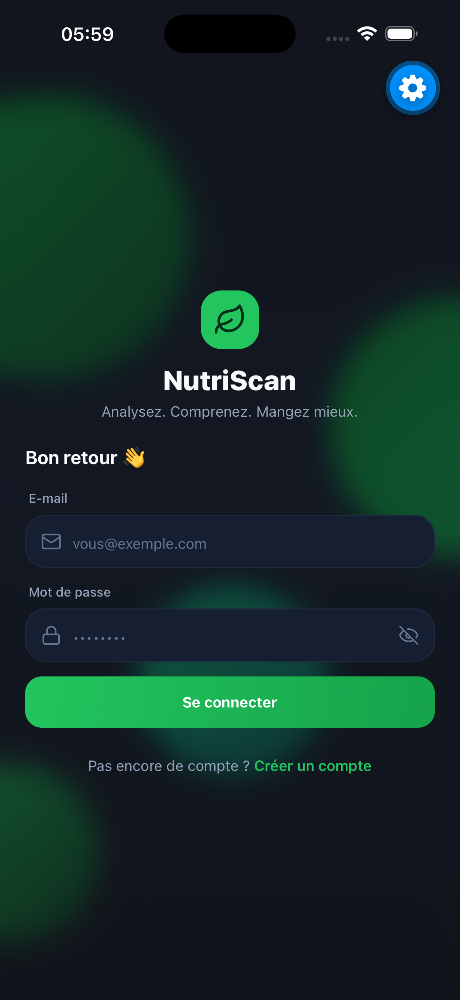
  &nbsp;&nbsp;
  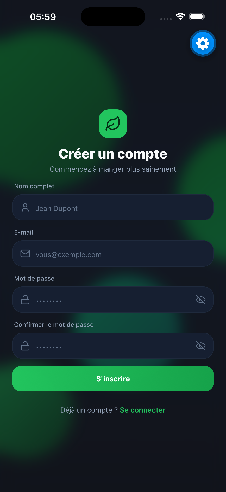
  &nbsp;&nbsp;
  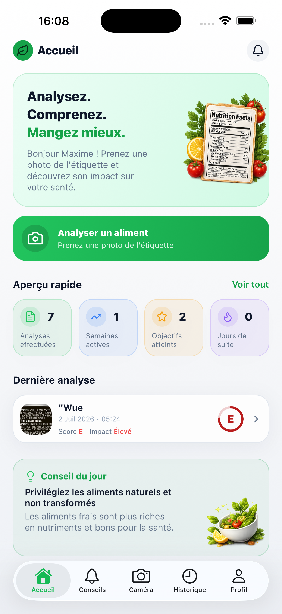
  &nbsp;&nbsp;
  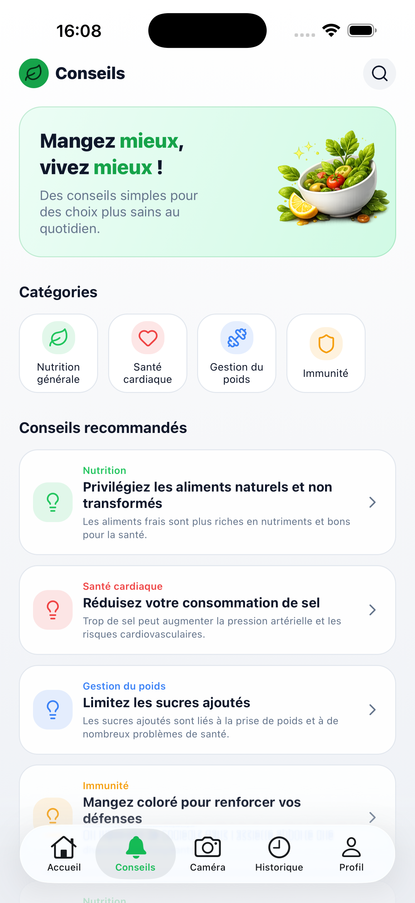
</p>

<p align="center">
  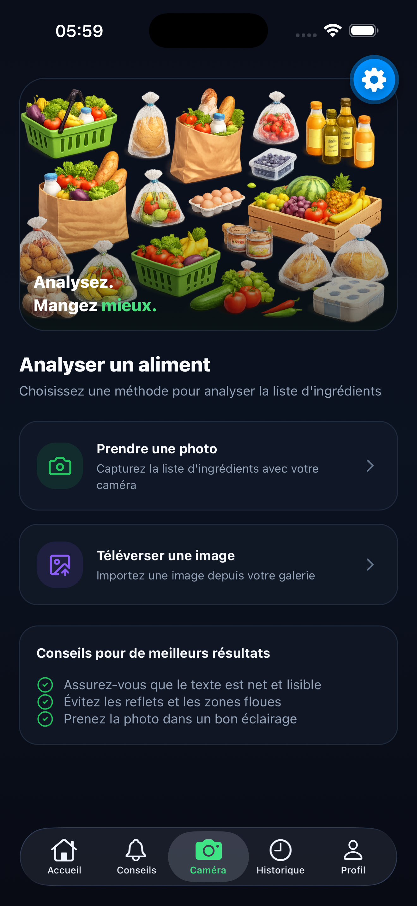
  &nbsp;&nbsp;
  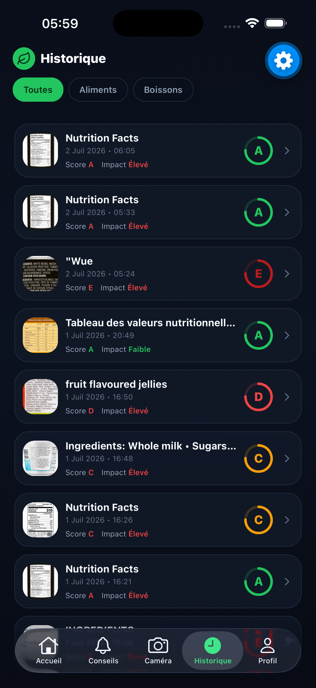
  &nbsp;&nbsp;
  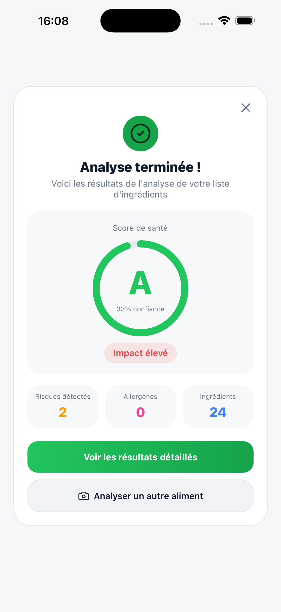
  &nbsp;&nbsp;
  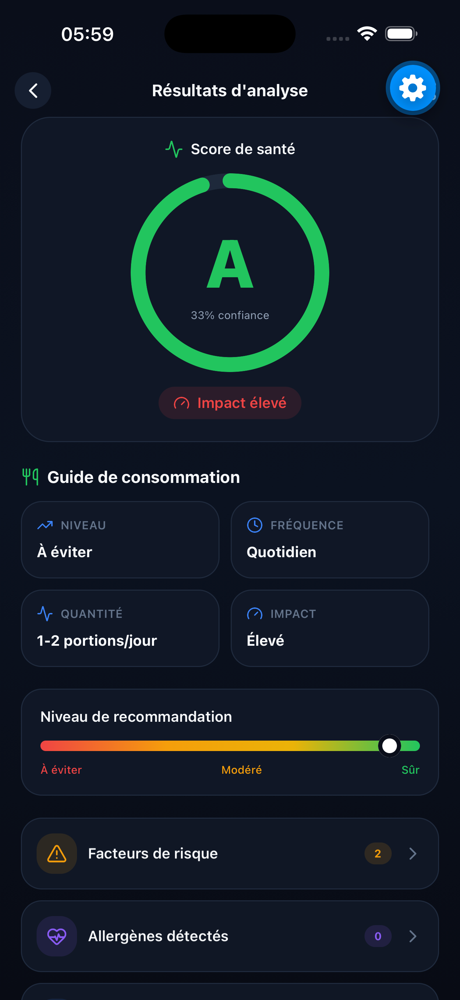
</p>

<p align="center">
  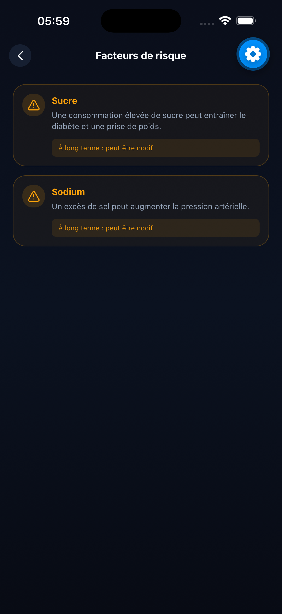
  &nbsp;&nbsp;
  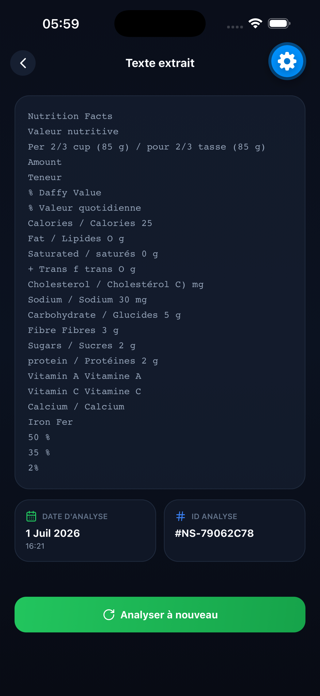
  &nbsp;&nbsp;
  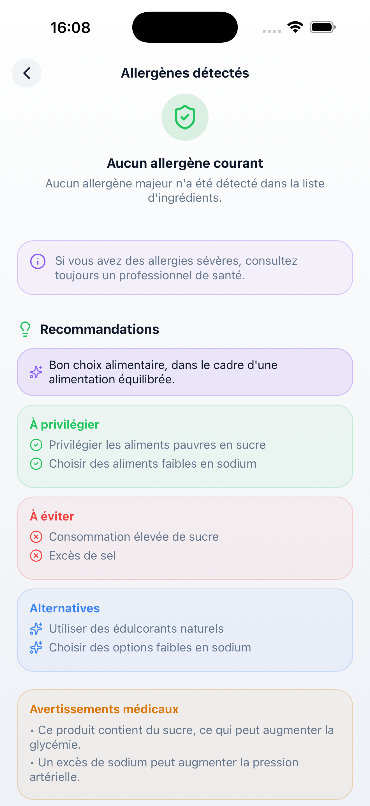
  &nbsp;&nbsp;
  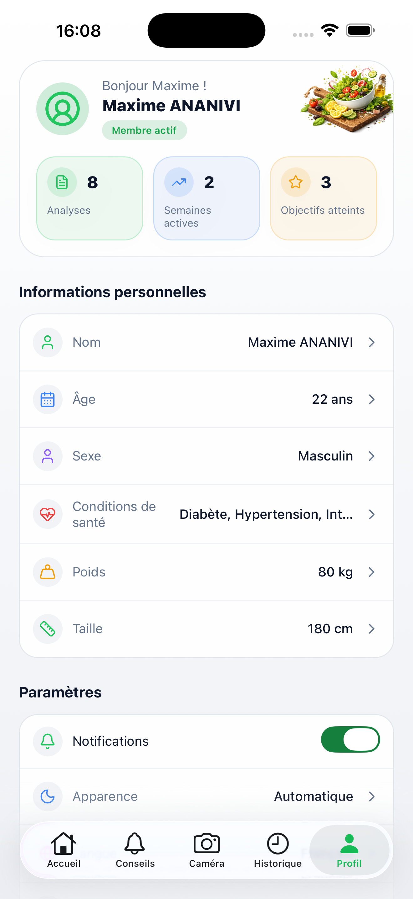
</p>

---


## Architecture générale

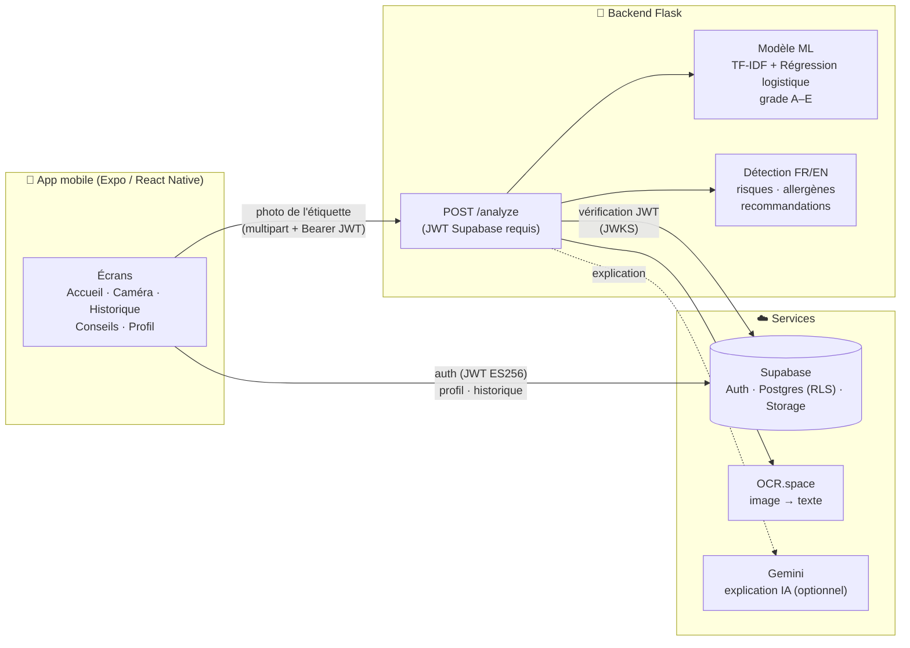

**Flux d'une analyse :**

1. L'utilisateur photographie (ou téléverse) une étiquette dans l'app.
2. L'app envoie l'image à `POST /analyze` avec son token Supabase et ses
   conditions de santé.
3. Le backend : OCR → validation « aliment » → vectorisation TF-IDF →
   prédiction du grade A–E → détection risques/allergènes (FR/EN) →
   recommandations personnalisées (+ explication Gemini si configurée).
4. L'app enregistre le résultat dans Supabase (table `analyses`, protégée par
   RLS) et affiche les écrans de résultats (jauge, risques, allergènes, texte
   extrait).

## Démarrage rapide

Ordre recommandé :

```bash
# 1. Base de données — exécuter le schéma dans Supabase (SQL Editor)
#    → mobile/supabase/migrations/0001_init.sql

# 2. Backend
cd backend
pip install -r requirements.txt
cp .env.example .env          # OCR_API_KEY, SUPABASE_JWKS_URL…
python3 -m flask --app app run --host 0.0.0.0 --port 5050

# 3. App mobile
cd ../mobile
npm install
cp .env.example .env          # URL/clé Supabase + URL de l'API
npx expo start
```

> ⚠️ **Port 5050** en local : le port 5000 est occupé par le récepteur AirPlay
> de macOS. Détails et pièges (simulateur iOS, variables `EXPO_PUBLIC_*`) dans
> [mobile/README.md](mobile/README.md).

## Arborescence

```
AI Food Ingredient Analyzer/
├── backend/                  API Flask + modèle ML (voir backend/README.md)
│   ├── app.py                Endpoints /health et /analyze, garde JWT
│   ├── utils.py              OCR helpers, détection risques/allergènes, recos
│   ├── main_model.pkl        Classifieur (grade A–E)
│   ├── vectorizer_model.pkl  Vectoriseur TF-IDF
│   └── render.yaml           Déploiement Render
└── mobile/                   App Expo (voir mobile/README.md)
    ├── src/app/              Écrans (expo-router)
    ├── src/components/       Composants UI réutilisables
    ├── src/lib/              Supabase, API, thème, requêtes
    └── supabase/migrations/  Schéma SQL (tables, RLS, triggers, buckets)
```
