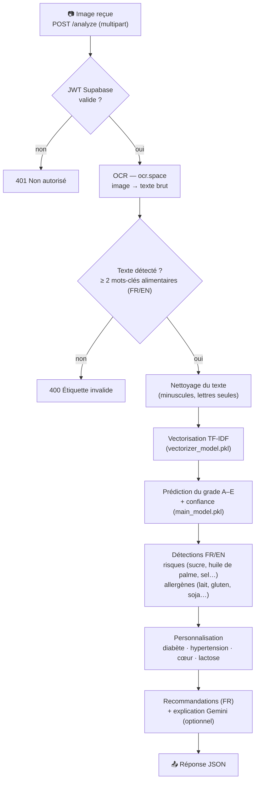

# 🧠 NutriScan — Backend (Flask + ML)

API REST qui transforme la **photo d'une étiquette alimentaire** en analyse
nutritionnelle : grade **A–E** prédit par un modèle de Machine Learning,
risques et allergènes détectés (français + anglais), recommandations
personnalisées selon les conditions de santé de l'utilisateur.

## Pipeline d'analyse



## Endpoints

| Méthode | Route | Description |
|---|---|---|
| `GET` | `/health` | Sonde de disponibilité → `{"status": "ok"}` |
| `POST` | `/analyze` | Analyse d'une image d'étiquette (multipart) |

### `POST /analyze`

**Requête** (`multipart/form-data`) :

| Champ | Type | Description |
|---|---|---|
| `image` | fichier | Photo de l'étiquette (jpeg/png…) |
| `health_conditions` | texte | CSV optionnel : `diabetes,blood_pressure,heart,lactose_intolerance` |

En-tête `Authorization: Bearer <token Supabase>` — requis si la vérification
JWT est configurée (voir ci-dessous).

**Réponse** (extrait) :

```json
{
  "analysis":        { "grade": "C", "confidence": 0.68, "impact": "Moderate" },
  "usage":           { "level": "Limit", "frequency": "2-3/week", "quantity": "Small portions", "impact": "Moderate" },
  "risks":           { "list": ["sugar", "palm oil"], "details": [ { "name": "...", "description": "..." } ] },
  "allergens":       { "list": ["milk", "gluten"],   "details": [ { "name": "...", "symptoms": "..." } ] },
  "recommendations": { "overall": "…", "do": ["…"], "avoid": ["…"], "alternatives": ["…"], "medical_warnings": ["…"] },
  "ai_explanation":  "…",
  "extracted_text":  "texte OCR brut"
}
```

Les clés techniques (`grade`, `level`, `impact`, noms de risques/allergènes)
restent en anglais — l'app mobile les traduit à l'affichage ; les textes de
recommandations sont générés en français.

## Authentification (JWT Supabase)

`/analyze` vérifie le token d'accès Supabase de l'utilisateur :

- **JWKS / ES256** (projets Supabase récents, clé asymétrique) : définir
  `SUPABASE_JWKS_URL` — vérification via la clé publique, algorithmes
  ES256/RS256, audience `authenticated`.
- **HS256 legacy** (secret partagé) : repli via `SUPABASE_JWT_SECRET`.
- **Aucune des deux variables** → vérification désactivée (pratique en dev).

## Modèle ML

- **Vectoriseur** : TF-IDF (unigrammes de mots) — `vectorizer_model.pkl`
- **Classifieur** : régression logistique multiclasse → grade `A`–`E`,
  avec probabilité maximale renvoyée comme **confiance** — `main_model.pkl`
- **Données d'entraînement** : `foods_health_scores_allergens.csv`
  (~5 000 produits : ingrédients, Nutri-Score, valeurs nutritionnelles,
  drapeaux allergènes)

## Installation & lancement

```bash
pip install -r requirements.txt
cp .env.example .env    # puis renseigner les clés
python3 -m flask --app app run --host 0.0.0.0 --port 5050
curl http://127.0.0.1:5050/health   # → {"status":"ok"}
```

> Le port **5050** évite le conflit avec le récepteur AirPlay de macOS (5000).
> `--host 0.0.0.0` permet à un appareil physique sur le réseau local d'accéder
> à l'API.

### Variables d'environnement (`.env`)

| Variable | Rôle | Requis |
|---|---|---|
| `OCR_API_KEY` | Clé [ocr.space](https://ocr.space/ocrapi) (lecture des étiquettes) | ✅ |
| `SUPABASE_JWKS_URL` | `https://<ref>.supabase.co/auth/v1/.well-known/jwks.json` — vérification ES256 | recommandé |
| `SUPABASE_JWT_SECRET` | Secret partagé HS256 (legacy) — repli | optionnel |
| `GEMINI_API_KEY` | Explication IA des résultats (français) | optionnel |

## Déploiement (Render)

`render.yaml` décrit le service : build `pip install -r requirements.txt`,
démarrage `gunicorn app:app`, Python `3.11.9` (`runtime.txt`).

> 💡 Pensez à définir **toutes** les variables d'environnement ci-dessus dans
> le dashboard Render — y compris `SUPABASE_JWKS_URL` pour activer la
> vérification des tokens en production.

## Structure

```
backend/
├── app.py                             Endpoints, garde JWT, orchestration du pipeline
├── utils.py                           Nettoyage texte, détections FR/EN, recommandations, Gemini
├── main_model.pkl                     Classifieur (grade A–E)
├── vectorizer_model.pkl               Vectoriseur TF-IDF
├── foods_health_scores_allergens.csv  Données d'entraînement
├── requirements.txt                   Dépendances Python
├── runtime.txt                        Version Python (Render)
└── render.yaml                        Configuration de déploiement
```
