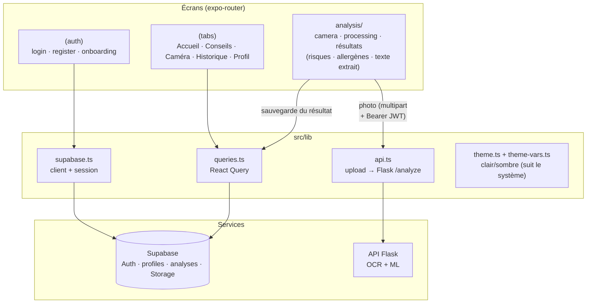

# 📱 NutriScan — App mobile (Expo + Supabase)

Application mobile d'analyse d'étiquettes alimentaires. Photo de l'étiquette →
API Flask (OCR + modèle ML) → score de santé A–E, risques, allergènes et
recommandations personnalisées. Authentification, profil et historique via
Supabase.

## Stack

- **Expo SDK 57 (React Native) + TypeScript**, [expo-router](https://docs.expo.dev/router/introduction/) (navigation par fichiers)
- **NativeWind v4** (Tailwind CSS) — thème clair/sombre par variables CSS
- **Supabase** (Auth JWT ES256 · Postgres avec RLS · Storage) — `src/lib/supabase.ts`
- **TanStack React Query** (état serveur : historique, profil, stats) — `src/lib/queries.ts`
- **Tab bar native iOS** (liquid glass) — `expo-router/unstable-native-tabs`
- Reanimated (animations, orbes, jauge SVG) · Haptics · Gesture Handler (swipe-to-delete)

## Architecture



**Flux d'une analyse** : Caméra/galerie → `analysis/processing` → upload
multipart vers Flask (`uploadAsync` d'`expo-file-system` — le `fetch`+FormData
de RN 0.86 ne supporte pas les fichiers) → résultat JSON → insertion dans la
table `analyses` (RLS par utilisateur) + upload de la miniature dans Storage →
écrans de résultats.

**Thème** : l'apparence suit le réglage **clair/sombre du téléphone**
(`userInterfaceStyle: "automatic"`). Les tokens de couleur sont des variables
CSS appliquées par le layout racine via `vars()` (NativeWind) ; les couleurs
côté JS (SVG, dégradés, icônes) passent par le hook `useColors()`.

## Installation

### 1. Base de données Supabase

1. Créez un projet sur [supabase.com](https://supabase.com).
2. SQL Editor → exécutez `supabase/migrations/0001_init.sql`
   (tables `profiles` / `analyses`, RLS, trigger de création de profil, buckets Storage).
3. Authentication → Providers → Email : en développement, désactivez
   « Confirm email » pour être connecté dès l'inscription.

### 2. Backend Flask

Voir [`../backend/README.md`](../backend/README.md). En résumé :

```bash
cd ../backend
pip install -r requirements.txt
cp .env.example .env      # OCR_API_KEY, SUPABASE_JWKS_URL…
python3 -m flask --app app run --host 0.0.0.0 --port 5050
```

### 3. App mobile

```bash
npm install
cp .env.example .env
npx expo start            # puis i (simulateur iOS) / a (Android) / Expo Go
```

| Variable (`.env`) | Valeur |
|---|---|
| `EXPO_PUBLIC_SUPABASE_URL` | Project Settings → API → Project URL |
| `EXPO_PUBLIC_SUPABASE_ANON_KEY` | Clé publiable (`sb_publishable_…`) |
| `EXPO_PUBLIC_API_URL` | Simulateur iOS : `http://127.0.0.1:5050` · Appareil : `http://<IP-LAN>:5050` |

### ⚠️ Pièges connus (dev local)

- **`127.0.0.1`, pas `localhost`** pour le simulateur iOS (`localhost` résout
  en IPv6 `::1`, où Flask n'écoute pas).
- **Port 5050** : le 5000 est occupé par le récepteur AirPlay de macOS.
- Toute modification d'une variable `EXPO_PUBLIC_*` exige un redémarrage de
  Metro **avec `npx expo start --clear`** (les valeurs sont inlinées et mises
  en cache).

## Parcours utilisateur

Inscription → onboarding (nom, âge, sexe, conditions de santé) → Accueil →
Caméra (photo ou galerie) → analyse → résultats détaillés (jauge de score,
guide de consommation, risques, allergènes, texte extrait) → Historique
(suppression par balayage) · Conseils · Profil (édition, apparence
automatique, déconnexion).

## Structure

```
src/
  app/                    écrans (expo-router)
    (auth)/               login, register, onboarding (+ orbes animés en sombre)
    (tabs)/               index (Accueil), tips, analyze, history, profile
    analysis/             camera, processing, [id]/{index,risks,allergens,extracted}
    tips/[id].tsx         détail d'un conseil
  components/
    ui/                   Button, Card, Chip, Input, ScoreGauge, Skeleton,
                          StatCard, AnimatedNumber, AnimatedOrb, AuthOrbs…
    analysis/             RiskCard, AllergenCard, RecommendationSlider
    AnalysisListItem.tsx  élément d'historique (+ SwipeableAnalysisItem)
  lib/
    supabase.ts           client Supabase (session persistée AsyncStorage)
    auth.tsx              AuthProvider + gate de navigation
    api.ts                appel Flask /analyze (uploadAsync multipart)
    queries.ts            hooks React Query (analyses, stats, profil)
    theme.ts, theme-vars.ts  palettes clair/sombre + variables CSS
    labels.ts             traductions FR des clés API (risques, allergènes…)
  data/tips.ts            contenu éditorial des Conseils
supabase/migrations/0001_init.sql   schéma SQL complet
```

## Note sécurité

La session Supabase est persistée via AsyncStorage (approche officielle Expo).
Les buckets Storage sont en lecture publique (miniatures d'étiquettes non
sensibles) mais l'écriture est restreinte au dossier de chaque utilisateur.
Les tables `profiles` et `analyses` sont protégées par **RLS** : chaque
utilisateur ne voit que ses propres données.
